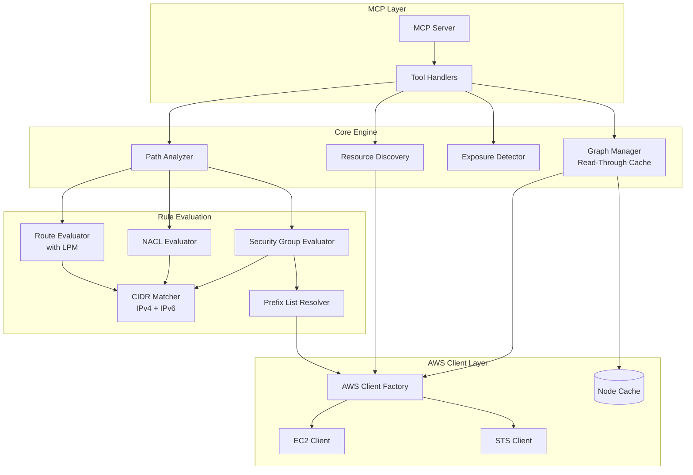
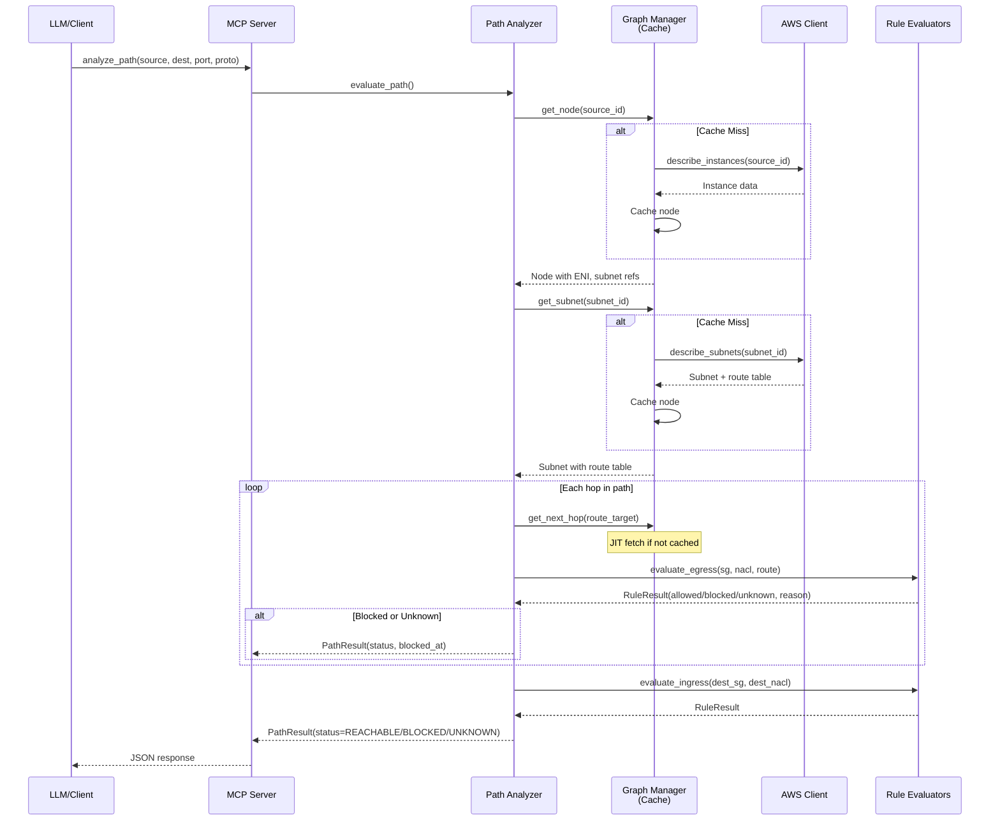
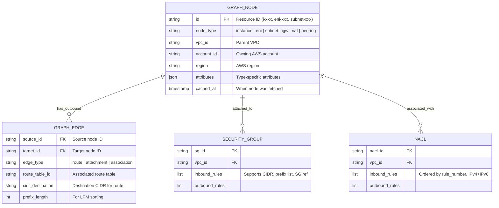

# NetGraph

**Model Context Protocol (MCP) server for AWS VPC network topology analysis**

NetGraph models AWS VPC infrastructure as a NetworkX directed graph, enabling deterministic reachability analysis and security auditing for AI agents. It evaluates Security Groups, NACLs, and route tables to answer questions like "Can instance A reach instance B on port 443?"

## Features

- **Lazy Graph-Based Topology** - Represent VPC resources (instances, ENIs, subnets, gateways) as NetworkX DiGraph nodes with routing relationships as directed edges
- **Accurate Rule Evaluation** - Handle stateful Security Groups vs stateless NACLs correctly, with Managed Prefix List support
- **Dual-Stack Networking** - Full IPv4 and IPv6 support throughout all evaluators
- **Cross-Account Traversal** - Support VPC peering analysis across AWS accounts via STS role assumption
- **LLM-Friendly Discovery** - Tag-based resource lookup to bridge natural language queries to AWS resource IDs

## Architecture



## Data Flow



## Installation

```bash
# Clone the repository
git clone https://github.com/ayushgoel/mcp-netgraph.git
cd mcp-netgraph

# Create and activate virtual environment (Python 3.10+)
python -m venv .venv
source .venv/bin/activate

# Install in development mode
pip install -e ".[dev]"
```

## MCP Tools

### analyze_path

Analyze network reachability from source to destination with hop-by-hop evaluation.

```python
analyze_path(
    source_id="i-1234567890abcdef0",  # EC2 instance or ENI ID
    dest_ip="10.0.2.100",              # IPv4 or IPv6 destination
    port=443,
    protocol="tcp",
    force_refresh=False                # Bypass cache after AWS changes
)
```

**Returns:** `PathAnalysisResult` with status (REACHABLE, BLOCKED, UNKNOWN), full hop path, and blocking details if blocked.

### find_public_exposure

Find all resources exposed to the public internet on a specified port.

```python
find_public_exposure(
    port=22,                           # Port to check
    protocol="tcp",
    severity_filter="critical",        # Optional: "all", "high", "critical"
    vpc_ids=["vpc-123"]                # Optional: limit to specific VPCs
)
```

**Returns:** `PublicExposureResult` with exposed resources and remediation guidance.

### find_resources

Tag-based resource discovery for natural language queries.

```python
find_resources(
    name_pattern="web-*",              # Glob pattern for Name tag
    tags={"Environment": "prod"},      # Filter by tags
    resource_type="instance",          # instance, eni, subnet, security_group, vpc
    vpc_id="vpc-123",                  # Optional VPC filter
    limit=20
)
```

**Returns:** `ResourceDiscoveryResult` with matching resources including IDs, IPs, and tags.

### refresh_topology (Optional)

Pre-warm the graph cache with VPC topology for faster subsequent queries.

```python
refresh_topology(
    vpc_ids=["vpc-123", "vpc-456"],
    cross_account_roles={"123456789012": "arn:aws:iam::123456789012:role/NetGraphRole"}
)
```

## Key Design Decisions

| Decision | Rationale |
|----------|-----------|
| **Lazy Loading (JIT)** | Eager ingestion times out on accounts with 5000+ ENIs; fetch only what's needed during path traversal |
| **Explicit LPM Algorithm** | Route selection via Longest Prefix Match must be explicit and testable, not implicit |
| **PathStatus.UNKNOWN** | Distinguish "blocked by rule" from "couldn't determine due to permission failure" |
| **NACL Return Path Verification** | NACLs are stateless - must verify return traffic (ephemeral ports 1024-65535) can reach source |
| **Reverse Path Routing** | Destination subnet must have route back to source IP to prevent asymmetric routing failures |
| **Cache TTL (60s)** | Prevents stale cache from causing false negatives after user fixes rules in AWS Console |
| **Loop Detection** | Network graphs can be cyclic; visited_nodes set prevents infinite traversal |

## Graph Schema



## Implementation Status

| Phase | Status | Description |
|-------|--------|-------------|
| Phase 1 | ✅ Complete | Project foundation, exceptions, logging |
| Phase 2 | ✅ Complete | Pydantic data models (graph, AWS resources, results) |
| Phase 3 | ✅ Complete | Rule evaluators (SG, NACL, Route, CIDR) |
| Phase 4 | ✅ Complete | AWS client with pagination, retry, cross-account support |
| Phase 5 | ✅ Complete | Core engine: GraphManager with read-through cache |
| Phase 6A | ✅ Complete | PathAnalyzer with deterministic LPM traversal |
| Phase 6B | ✅ Complete | MCP tools and server integration |
| Phase 7 | ✅ Complete | Integration tests, performance tests, documentation |

## Development

```bash
# Run tests
pytest                              # All tests
pytest tests/unit/                  # Unit tests only
pytest -k "test_cidr"               # Tests matching pattern
pytest --cov                        # With coverage

# Type checking
mypy src/

# Linting
ruff check src/ tests/
ruff format src/ tests/
```

## Project Structure

```
src/netgraph/
├── server.py                # MCP server entry point
├── utils/logging.py         # Structured logging
├── models/
│   ├── errors.py            # Exception hierarchy
│   ├── graph.py             # NodeType, GraphNode, GraphEdge
│   ├── results.py           # PathStatus, PathAnalysisResult
│   └── aws_resources.py     # SGRule, NACLRule, Route, etc.
├── evaluators/
│   ├── cidr.py              # CIDRMatcher with LRU cache
│   ├── route.py             # RouteEvaluator with LPM
│   ├── nacl.py              # NACLEvaluator (stateless)
│   └── security_group.py    # SecurityGroupEvaluator (stateful)
├── aws/
│   ├── client.py            # AWSClient, AWSClientFactory
│   └── fetcher.py           # EC2Fetcher with auto-pagination
├── core/
│   ├── graph_manager.py     # Read-through cache, topology building
│   ├── path_analyzer.py     # Deterministic LPM traversal
│   ├── exposure_detector.py # Public internet exposure scanning
│   └── resource_discovery.py # Tag-based resource lookup
└── tools/                   # MCP tool implementations

tests/
├── unit/                    # Unit tests for all modules
├── integration/             # E2E scenario and MCP protocol tests
├── performance/             # Large VPC performance benchmarks
└── fixtures/                # VPC topology and prefix list fixtures

scripts/
└── verify_live.py           # Live AWS sandbox verification

docs/
└── examples.md              # Example Claude prompts
```

## AWS Permissions Required

The IAM principal running NetGraph needs these EC2 read permissions:

```json
{
    "Version": "2012-10-17",
    "Statement": [
        {
            "Effect": "Allow",
            "Action": [
                "ec2:DescribeInstances",
                "ec2:DescribeSubnets",
                "ec2:DescribeSecurityGroups",
                "ec2:DescribeNetworkAcls",
                "ec2:DescribeRouteTables",
                "ec2:DescribeInternetGateways",
                "ec2:DescribeNatGateways",
                "ec2:DescribeVpcs",
                "ec2:DescribeVpcPeeringConnections",
                "ec2:DescribeNetworkInterfaces",
                "ec2:DescribeTransitGateways",
                "ec2:DescribeTransitGatewayAttachments",
                "ec2:GetManagedPrefixListEntries"
            ],
            "Resource": "*"
        }
    ]
}
```

For cross-account analysis, add `sts:AssumeRole` permission and configure trust relationships on target account roles.

## Live AWS Verification

Before deploying to production, verify NetGraph behavior against a real AWS account:

```bash
# Run all verification checks
AWS_PROFILE=dev-sandbox python scripts/verify_live.py

# Verbose output with details
AWS_PROFILE=dev-sandbox python scripts/verify_live.py --verbose

# Run a single check
AWS_PROFILE=dev-sandbox python scripts/verify_live.py --check pagination
```

The verification script validates:
- Error code formats match expectations
- Pagination returns complete data sets
- Prefix list resolution works correctly
- Response structures match what NetGraph expects
- Filter behavior is correct

This helps catch discrepancies between moto mocks and actual AWS behavior.

## Example Prompts

See [docs/examples.md](docs/examples.md) for example prompts to use with Claude, including:
- Debugging connection issues
- Security audits
- Pre-deployment validation
- Cross-VPC analysis
- Troubleshooting intermittent issues

## License

MIT
